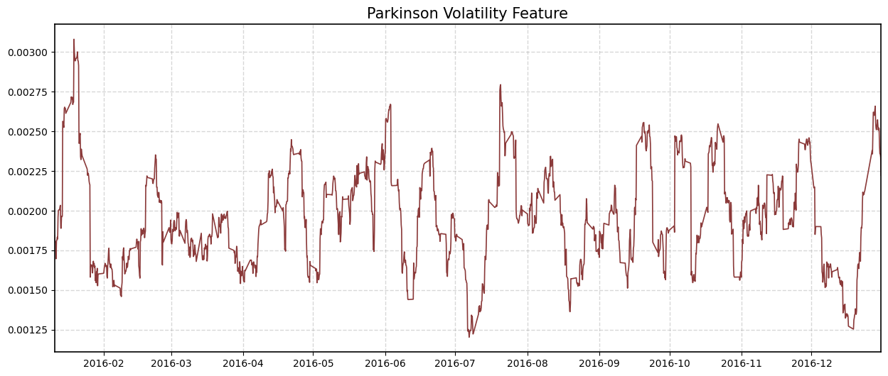

# Welcome to Quantreo

**A faster way to build quantitative features, targets, and alternative bars in Python. Powered by Numba.**


[](https://pypi.org/project/quantreo/)

[](https://pepy.tech/project/quantreo)
[](https://docs.quantreo.com)
[](https://github.com/Quantreo/quantreo/blob/main/LICENSE.txt)


<br>

## What is Quantreo?

Quantreo is a Python toolbox that helps you build quantitative features, targets, and alternative bars, faster and more efficiently.

It’s designed for quantitative researchers, data scientists, and traders who want to transform raw market data into ML-ready datasets in just a few lines of code.
From volatility estimators to event-based bars and regime indicators, Quantreo provides a high-performance foundation for systematic trading research.

### 1. Why choose Quantreo?

- **High-performance**: Built with Numba and vectorization for ultra-fast computations  
- **Research-oriented**: Designed for feature and target engineering in quant finance  
- **Modular & Pythonic**: Clean, intuitive API compatible with pandas & scikit-learn  
- **Alternative bars included**: Time, tick, volume & run bars  
- **Robust by design**: Functions implemented to avoid data leakage and look-ahead bias.

<br>

### 2. Main modules

- `quantreo.features_engineering`: Volatility, trend, entropy, and statistical indicators  
- `quantreo.target_engineering`: triple barrier, event-based targets and regime classification  
- `quantreo.alternative_bars`: Time, tick, volume, and run bars  
- `quantreo.datasets`: Synthetic or real OHLCV generators for fast testing


<br>
<br>

## Install Quantreo
```bash
pip install quantreo
```

If the installation completes successfully, you're all set to start using **Quantreo**. If you encounter any issues, please refer to our [documentation](https://docs.quantreo.com) for troubleshooting tips.


Quantreo provides a collection of ready-to-use tools for **feature engineering**, **target construction**, and **alternative bar generation**, all optimized for performance and ease of use.  
Jump to the [Quick start](#quickstart) section below to see how it works in practice.

---
##  Quickstart

Quantreo makes it easy to test, explore, and create new quantitative features and targets in just a few lines.

### 1. Generate synthetic OHLCV data

Use the built-in dataset generator to quickly get a realistic sample of market data.  
Perfect for experimenting or creating your own custom functions.

```python
from quantreo.datasets import load_generated_ohlcv

df = load_generated_ohlcv()
df.head()
```

<br>

### 2. Use existing functions: example with volatility
Compute a ready-to-use volatility feature in just two lines.

```python
import quantreo.features_engineering as fe

df["parkinson_vol"] = fe.volatility.parkinson_volatility(df=df, high_col="high", low_col="low", window_size=30)
```
Then, you can easily visualize your computed feature to check its behavior over time:




### 3. Give me more!

Want to go further? Here are a few examples of what you can build with Quantreo:

- [Meta-Labeling Tutorial](https://docs.quantreo.com/tutorials/tutorial-meta-labeling/): Use Quantreo to generate dynamic targets and improve model precision.  
- [Multi-Asset Feature Engineering](https://docs.quantreo.com/tutorials/tutorial-multi-asset-feature-engineering-in-financial-ml/): Combine multiple assets to uncover cross-market patterns.  
- [PCA in Trading](https://docs.quantreo.com/tutorials/tutorial-pca-in-trading/): Apply principal component analysis to understand market structure.

See all tutorials here → [**Quantreo for Beginners**](https://docs.quantreo.com/tutorials/Quantreo-for-beginners/)

---

## Resources

- Explore our [documentation](https://docs.quantreo.com) to learn how Quantreo works.  
- Ask questions or report issues directly on our [GitHub repository](https://github.com/Quantreo/quantreo).  
- Discover practical examples and in-depth use cases in our [tutorials section](https://docs.quantreo.com/tutorials/Quantreo-for-beginners/).  
- Learn how to create features and targets like a pro in the [ML4Trading course](https://quantreo.com/ml4trading).  


---
## Cite Quantreo

If you use **Quantreo** in your research or project, please consider citing it as:

> Inglese, L. (2025). *Quantreo: A Python library for quantitative feature and target engineering.*  
> Available at: https://github.com/Quantreo/quantreo

---
## License
MIT © Lucas Inglese, 2025

Feel free to reach out at **lucas@quantreo.com**.