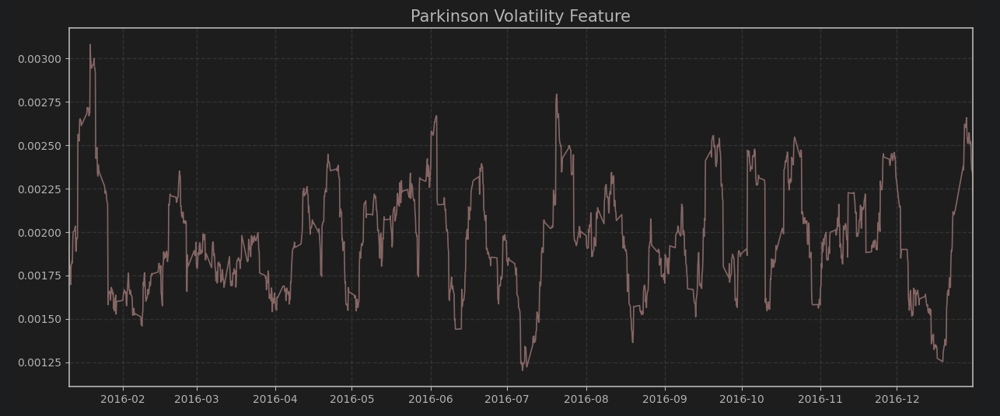

# **Welcome to Quantreo**
**A faster way to build quantitative features, targets, and alternative bars in Python. Powered by Numba.**

[](https://pypi.org/project/quantreo/)

[](https://pepy.tech/project/quantreo)
[](https://docs.quantreo.com)
[](https://github.com/Quantreo/quantreo/blob/main/LICENSE.txt)


<br>

Quantreo provides a high-performance research framework for building features, targets, and alternative bars in Python.
Its goal is to help quantitative researchers transform raw market data into machine-learning-ready datasets quickly, efficiently, and without data leakage.

Each module is built around the principles of clarity, reproducibility, and performance, using Numba for just-in-time optimization.
Whether your goal is alpha research, backtesting, or production-ready model development, Quantreo offers a consistent and modular workflow.
<br>


<p align="center" style="margin-top: 24px;">

<a class="md-button"
   style="color: white; border: 1px solid #607CF6; background: transparent; border-radius: 8px; padding: 15px 30px; transition: 0.2s;"
   onmouseover="this.style.background='#607CF6';"
   onmouseout="this.style.background='transparent';"
   href="/tutorials/Quantreo-for-beginners/">
  💡 Get Started
</a>


<a class="md-button"
   style="color: white; border: 1px solid #607CF6; background: transparent; border-radius: 8px; padding: 15px 30px; transition: 0.2s;"
   onmouseover="this.style.background='#607CF6';"
   onmouseout="this.style.background='transparent';"
   href="/data-aggregation/Get-Started/">
  📘 Documentation
</a>

<a class="md-button"
   style="color: white; border: 1px solid #607CF6; background: transparent; border-radius: 8px; padding: 15px 30px; transition: 0.2s;"
   onmouseover="this.style.background='#607CF6';"
   onmouseout="this.style.background='transparent';"
   href="https://github.com/Quantreo/quantreo">
  ⚙️ GitHub
</a>
</p>


---

## Main Packages

Quantreo is built for quantitative research, Numba-optimized, leakage-safe, and fully compatible with pandas and scikit-learn,
ensuring fast and reproducible data transformations across all modules.

| Package                                                      | Purpose | Example Capabilities |
|:-------------------------------------------------------------|:---------|:--------------------|
| [`Data Aggregation`](/data-aggregation/Get-Started/)         | Transform raw tick data into structured OHLCV bars | Time bars, tick bars, volume bars, run bars |
| [`Features Engineering`](/features-engineering/Get-Started/) | Extract predictive information from price and volume | Volatility, entropy, trend, statistical structure |
| [`Target Engineering`](/target-engineering/Get-Started/)      | Build machine-learning targets without data leakage | Triple-barrier, meta-labeling, event-based labeling |

Each module can be used independently or combined into a complete research pipeline, from raw data to model-ready datasets.


---
## Installation

Quantreo is available on [PyPI](https://pypi.org/project/quantreo/) and can be installed with `pip`:

```bash
pip install quantreo
```

To verify your installation:

```python
import quantreo
print(quantreo.__version__)
```

---
## Quick Start
Compute a ready-to-use volatility feature in just two lines.

```python
import quantreo.features_engineering as fe

df["parkinson_vol"] = fe.volatility.parkinson_volatility(df=df, high_col="high",
                                                         low_col="low", window_size=30)
```
Then, you can easily visualize your computed feature to check its behavior over time:



---
## Real-Life Applications

Quantreo is not just a feature library, it’s designed for real research workflows. Explore practical examples demonstrating how to apply Quantreo in end-to-end trading research pipelines.

Each notebook showcases real-world use cases of Quantreo, from feature design to model-ready data generation.

| Example                                                                                               | Description |
|:------------------------------------------------------------------------------------------------------|:-------------|
| [**Meta-Labelling Explained**](/applications/Meta-Labelling-Explained/)                               | Learn how to apply meta-labelling to improve signal precision and reduce false positives in trading strategies. |
| [**Multi-Asset Feature Engineering in Financial ML**](/applications/Multi-Asset-Feature-Engineering/) | Discover how to build and standardize multi-asset features for cross-asset modeling and synthetic dataset generation. |
| [**Dimensionality Reduction in Trading**](/applications/Dimensionality-Reduction-in-Trading/)         | Use Kernel PCA to create synthetic volatility features and reduce feature space complexity in ML models. |


---

## Troubleshooting & Support

If you encounter any issue with installation or usage, please don’t hesitate to reach out.

You can:

- **Contact the maintainer:** [lucas@quantreo.com](mailto:lucas@quantreo.com)  
- **Open an issue:** [GitHub Issues](https://github.com/Quantreo/quantreo/issues)

All feedback and bug reports are welcome, they help improve Quantreo’s performance, reliability, and usability for the quantitative research community.


=== "Latest"

    ```bash
    pip install mkdocs-material
    ```

=== "9.x"

    ```bash
    pip install mkdocs-material==9.*
    ```

